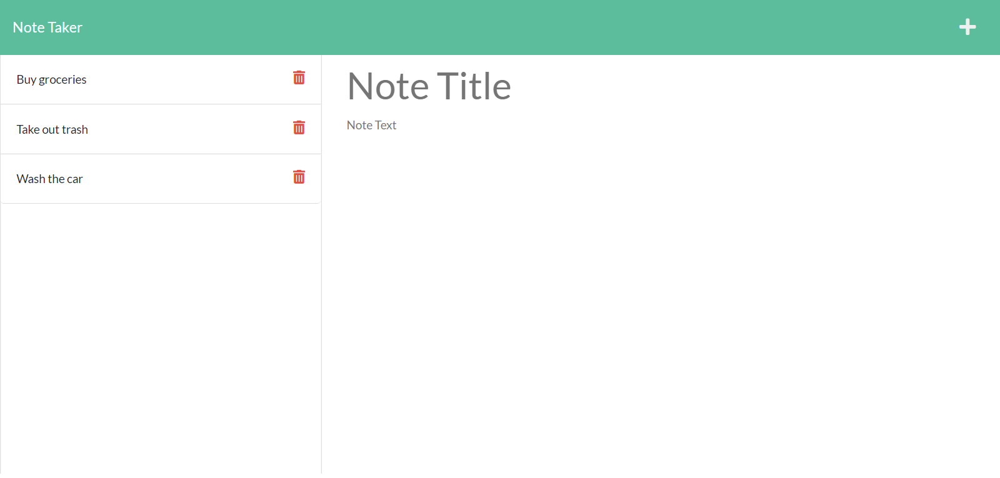

[]
# Note-Taker
Module 11 Challenge by Sergey Holin

GitHub Repo Link: https://github.com/sergeyholin/Note-Taker

Heroku Live Deployment Link: 

## ABOUT THE APP:

This application is a simple note taker program which uses Express.js for back end framework and saves & retrieves data from a JSON file.

## ACCEPTANCE CRITERIA:

```
GIVEN a note-taking application
WHEN I open the Note Taker
THEN I am presented with a landing page with a link to a notes page
WHEN I click on the link to the notes page
THEN I am presented with a page with existing notes listed in the left-hand column, plus empty fields to enter a new note title and the note’s text in the right-hand column
WHEN I enter a new note title and the note’s text
THEN a Save icon appears in the navigation at the top of the page
WHEN I click on the Save icon
THEN the new note I have entered is saved and appears in the left-hand column with the other existing notes
WHEN I click on an existing note in the list in the left-hand column
THEN that note appears in the right-hand column
WHEN I click on the Write icon in the navigation at the top of the page
THEN I am presented with empty fields to enter a new note title and the note’s text in the right-hand column
```

## TECHNOLOGIES USED: 

NODE.js (https://nodejs.org/en/)

Express.js (https://expressjs.com/)

## CITATIONS:

In server.js line 57 was inspired by an answer on stack overflow by GregL.
Source: (https://stackoverflow.com/questions/65015000/how-do-i-use-express-js-app-delete-to-remove-a-specific-object-from-an-array#:~:text=Assuming%20your%20array%20is%20just,req%2C%20res)%20%7B%20console.)

## SCREENSHOT:

